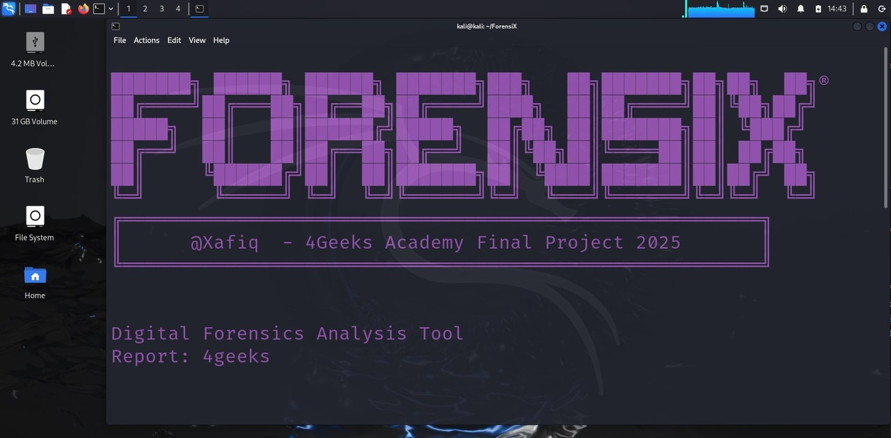

# ForensiX.sh

```bash
███████╗ ██████╗ ██████╗ ███████╗███╗   ██╗███████╗██╗██╗  ██╗®
██╔════╝██╔═══██╗██╔══██╗██╔════╝████╗  ██║██╔════╝██║╚██╗██╔╝
█████╗  ██║   ██║██████╔╝█████╗  ██╔██╗ ██║███████╗██║ ╚███╔╝
██╔══╝  ██║   ██║██╔══██╗██╔══╝  ██║╚██╗██║╚════██║██║ ██╔██╗ 
██║     ╚██████╔╝██║  ██║███████╗██║ ╚████║███████║██║██╔╝ ██╗
╚═╝      ╚═════╝ ╚═╝  ╚═╝╚══════╝╚═╝  ╚═══╝╚══════╝╚═╝╚═╝  ╚═╝
╔════════════════════════════════════════════════════════╗
║      @Xafiq  - Proyecto Final de 4Geeks Academy 2025   ║
╚════════════════════════════════════════════════════════╝
```

ForensiX est un outil d'analyse forensique numérique de pointe conçu pour automatiser le processus de collecte et d'analyse des preuves forensiques d'un dispositif monté. Il génère des rapports détaillés pour aider à comprendre la nature et l'impact des incidents de sécurité. Cet outil est utilisé depuis l'hôte cible en utilisant le mode forensique de Kali USB boot.

## 🚀 Caractéristiques
- 🔍 **Vérification des Dépendances**: Assure que tous les outils nécessaires sont installés.
- 🛡️ **Bloqueur d'Écriture**: Assure qu'aucune donnée n'est écrite sur le dispositif cible pendant l'analyse.
- 🔢 **Checksums**: Calcule et vérifie les checksums pour assurer l'intégrité des données.
- 🖥️ **Collecte d'Informations Système**: Collecte des informations détaillées sur le matériel et les logiciels.
- 🌐 **Analyse Réseau**: Collecte la configuration réseau, les services et analyse le trafic.
- 🔒 **Analyse de Sécurité**: Analyse les comptes utilisateurs, les configurations de sécurité et les journaux.
- 👤 **Collecte d'Informations Utilisateur**: Extrait des informations liées à l'utilisateur du support cible.
- 📈 **Connexions Apache**: Analyse les journaux d'accès Apache pour obtenir des détails sur les connexions.
- 🕒 **Génération de Ligne de Temps**: Crée une ligne de temps de l'attaque basée sur les fichiers journaux.
- 📄 **Génération de Rapports HTML**: Génère des rapports HTML complets avec des découvertes et des recommandations.
- 📑 **Téléchargement de Rapports en PDF**: Télécharge des rapports au format PDF depuis le navigateur web.


## 📋 Utilisation
1. **Assurer les Dépendances**: Exécutez le script pour vérifier et installer toute dépendance manquante.
2. **Monter le Dispositif**: Fournissez le dispositif à analyser.
3. **Exécuter l'Analyse**: Le script effectuera plusieurs analyses et collectera des preuves.
4. **Générer des Rapports**: Choisissez le type de rapport à générer (Complet, Sécurité, Récupération, Exécutif).

## 🛠️ Exécuter le Script
```bash
sudo ./4n6.sh
```




## 📊 Types de Rapports
- **Rapport d'Analyse Complet**: Rapport complet couvrant tous les aspects de l'analyse.
- **Rapport d'Incident de Sécurité**: Axé sur les découvertes et recommandations liées à la sécurité.
- **Plan de Récupération**: Fournit un plan pour la récupération et la mitigation du système.
- **Présentation Exécutive**: Résumé de haut niveau adapté aux parties prenantes exécutives.


## 👨‍💻 Auteur
Créé par @Xafiq dans le cadre du Projet Final de 4Geeks Academy 2025.
