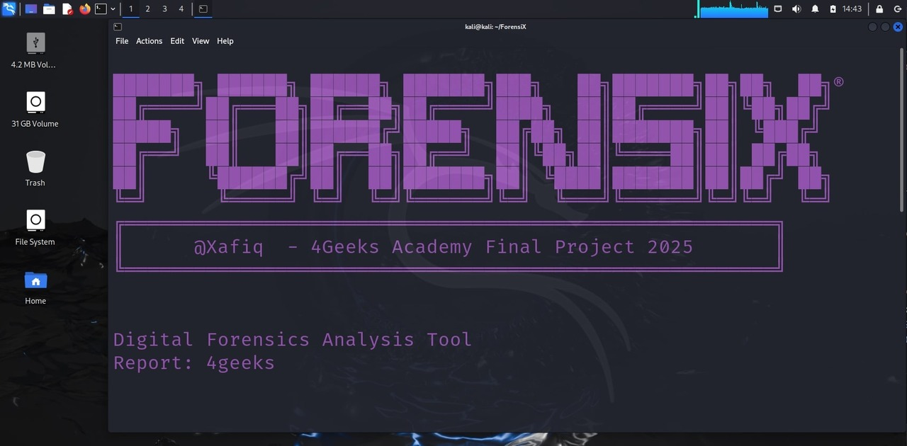

# ForensiX.sh

```bash
███████╗ ██████╗ ██████╗ ███████╗███╗   ██╗███████╗██╗██╗  ██╗®
██╔════╝██╔═══██╗██╔══██╗██╔════╝████╗  ██║██╔════╝██║╚██╗██╔╝
█████╗  ██║   ██║██████╔╝█████╗  ██╔██╗ ██║███████╗██║ ╚███╔╝ 
██╔══╝  ██║   ██║██╔══██╗██╔══╝  ██║╚██╗██║╚════██║██║ ██╔██╗ 
██║     ╚██████╔╝██║  ██║███████╗██║ ╚████║███████║██║██╔╝ ██╗
╚═╝      ╚═════╝ ╚═╝  ╚═╝╚══════╝╚═╝  ╚═══╝╚══════╝╚═╝╚═╝  ╚═╝
╔════════════════════════════════════════════════════════╗
║      @Xafiq  - 4Geeks Academy Final Project 2025       ║
╚════════════════════════════════════════════════════════╝
```

ForensiX is a digital forensics analysis tool designed to automate the process of collecting and analyzing forensic evidence from a mounted device. It generates detailed reports to assist in understanding the nature and impact of security incidents. This tool is used from inside the target host using Kali Forensic Mode USB boot.

## 🚀 Features
- 🔍 **Dependency Check**: Ensures all required tools are installed.
- 🛡️ **Write Blocker**: Ensures that no data is written to the target device during analysis.
- 🔢 **Checksums**: Calculates and verifies checksums to ensure data integrity.
- 🖥️ **System Information Collection**: Gathers detailed hardware and software information.
- 🌐 **Network Analysis**: Collects network configuration, services, and traffic analysis.
- 🔒 **Security Analysis**: Analyzes user accounts, security configurations, and logs.
- 👤 **User Information Collection**: Extracts user-related information from the target media.
- 📈 **Apache Connections**: Analyzes Apache access logs for connection details.
- 🕒 **Timeline Generation**: Creates a timeline of the attack based on log files.
- 📄 **HTML Report Generation**: Generates comprehensive HTML reports with findings and recommendations.
- 📑 **PDF Report Download**: Download from link on web browser reports to PDF format.


## 📋 Usage
1. **Ensure Dependencies**: Run the script to check and install any missing dependencies.
2. **Mount Device**: Provide the device to be analyzed.
3. **Run Analysis**: The script will perform various analyses and collect evidence.
4. **Generate Reports**: Choose the type of report to generate (Full, Security, Recovery, Executive).

## 🛠️ Running the Script
```bash
sudo ./4n6.sh
```




## 📊 Report Types
- **Full Analysis Report**: Comprehensive report covering all aspects of the analysis.
- **Security Incident Report**: Focused on security-related findings and recommendations.
- **Recovery Plan**: Provides a plan for system recovery and mitigation.
- **Executive Presentation**: High-level summary suitable for executive stakeholders.


## 👨‍💻 Author
Created by @Xafiq as part of the 4Geeks Academy Final Project 2025.
